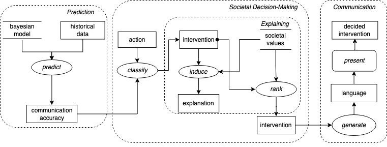

# Scenario 3 Task Decomposition

## Title 
Collective Decisions in Law and Economics.

## Description 
 An artificial agent (Actor) needs to intervene to resolve a dilemma (Scenario) in a
group decision, e.g. a jury (Actor). Bayesian logic (ProcessingMethod) is used as a meta-analytical tool to formalize the main criteria (i.e. individual and group accuracy in communication) for assessing when an intervention is (ir)responsible (EthicalConsideration), and to explain (Capability) the conditions (EndGoal) under which the autonomous agent should take the responsibility to act.

## Visual Task Decomposition

## Terminology 
(dynamic) historical data, communication accuracy, action, intervention, explanation, language, decided intervention. (static) Bayesian model, societal values.

## Inference Steps:
1. predict the communication accuracy using Bayesian modelling and past data;
2. classify interventions as (ir)/responsible based on an input action;
3. generate explanations for these based on known societal values;
4. rank the interventions based on societal values,
5. generate language-based interventions;
6. present the intervention to the group.

## Tasks 
Prediction (1), Societal Decision-Making (2-4), Explaining (3), Communicating (5-6).

