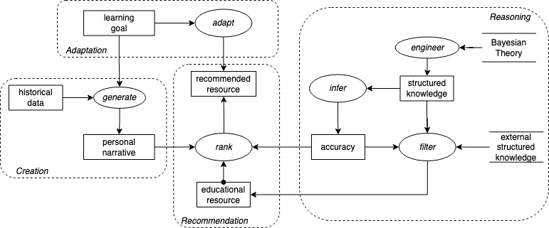

# Scenario 4 Task Decomposition

## Title 
Educational Recommenders with Narratives.

## Description 
An autonomous
artificial tutor (Actor) reconstructs the educational paths of individual learners (Actor) as personalized narratives, to recommend them educational resources based on their history. The agent uses Bayesian theory (ProcessingMethod) to model interests, prior knowledge of the learner and their semantic relatedness with the education topics, based on which it improves the performance of the recommendations. Public KGs such as WordNet and WikiData are used to perform high-level reasoning (ProcessingTask), ultimately fulfilling the learners’ learning goals more effectively (EndGoal) 

## Visual Task Decomposition

## Terminology 
(dynamic) learning goal, historical data, personal narrative, recommended resource, educational resource, accuracy, structured knowledge. (static) Bayesian Theory, external structured knowledge (KGs)

## Inference Steps:
1. generate personal narratives based on learning goals and historical data;
2. engineer topic models using Bayesian theories and
3. infer their accuracy;
4. rank educational resources based on personal narratives and computed accuracy;
5. filter resources based on external KGs;
6. adapt the recommendation based on the learner changing goals

## Tasks 
Creation (1), Reasoning (2-3,5), Recommendation (4), Adaptation (6)

